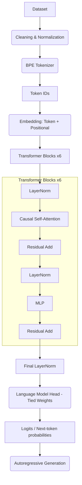

# Hermes Phase 1 Baseline

A from-scratch, decoder-only multilingual Transformer language model in PyTorch supporting English, Hindi (Devanagari), and Hinglish (code-mixed).

## Architecture



**Design decision:** the model is deliberately kept small rather than sized to maximize parameter count. Given the available free-tier GPU hardware, this size trains in a small number of hours per run, which keeps iteration, debugging, and re-running fast.

## Model

| Parameter | Value |
|---|---|
| Layers | 6 |
| Attention heads | 6 |
| Embedding dimension (d_model) | 384 |
| Context length | 320 |
| Vocabulary size | 16,000 |
| Parameters | 16,913,664 |

## Dataset

Hermes v1 uses three deliberately chosen, reproducible sources rather than a custom scrape, prioritizing reproducibility over dataset naturalism.

| Language | Source | Notes |
|---|---|---|
| English | Hugging Face `wikimedia/wikipedia` (`en`) | Clean, deterministic |
| Hindi (Devanagari) | Hugging Face `wikimedia/wikipedia` (`hi`) | Clean, deterministic |
| Hinglish (code-mixed) | `l3cube-pune/code-mixed-nlp` | Twitter-derived code-mixed corpus |

**Corpus size:**
- English: 60,000,018 approximate tokens
- Hindi: 60,000,127 approximate tokens
- Hinglish: 60,000,021 approximate tokens
- **Total: 180,000,166 tokens**

**Data Splits:**
- Train: 161,962,678 tokens (3,032,462 examples)
- Validation: 8,945,810 tokens (168,142 examples)
- Test: 9,091,678 tokens (168,881 examples)

## Tokenizer

- Custom BPE trained with the Hugging Face `tokenizers` library
- Shared vocabulary across all three languages/categories
- Target vocabulary size: 16,000 tokens
- Special tokens: `<pad>`, `<unk>`, `<bos>`, `<eos>` (dynamically extracted without hardcoded index assumptions)

## Training & Hardware

- **Objective:** standard causal language modeling (cross-entropy, next-token prediction, padding ignored in loss)
- **Optimizer:** AdamW
- **Schedule:** linear warmup + cosine decay
- **Tracking:** Weights & Biases when available, with a local-logging fallback
- **Hardware:** Trained entirely on free-tier cloud GPUs (Kaggle/Colab T4/P100).

## Evaluation Results (Step 10,000)

| Metric | Value |
|---|---|
| **Overall Validation Loss** | 4.757 |
| **Overall Test Loss** | 4.796 |
| **Overall Test Perplexity** | 121.13 |

**Language-Specific Breakdown:**

| Language | Test Loss | Test Perplexity |
|---|---|---|
| English | 6.734 | 840.60 |
| Hindi | 3.277 | 26.50 |
| Hinglish | 6.927 | 1019.81 |

## Generation Examples

These examples were generated using the Day 9 Baseline Checkpoint with greedy decoding (temperature=1.0, sampling disabled).

**English**
- *Prompt:* "The rapid development of artificial intelligence"
- *Generated:* `–18" and the P"`

**Hindi**
- *Prompt:* "भारत का इतिहास बहुत पुराना और"
- *Generated:* ` प्याहाहाहाहाहाहाहाहाहाहाहाहाहा`

**Hinglish**
- *Prompt:* "Mujhe lagta hai ki yeh movie"
- *Generated:* ` hai`

## Usage & Reproduction

### Requirements
Python 3.10+ and standard dependencies from `requirements.txt`:
```bash
pip install -r requirements.txt
```

### Commands
```bash
# Data and tokenizer preparation
python scripts/prepare_data.py
python scripts/train_tokenizer.py

# Training (uses configs/base.yaml)
python scripts/train.py --config configs/base.yaml

# Evaluation
python scripts/evaluate.py --config configs/base.yaml

# Generation
python scripts/run_generation.py

# Interactive Demo
python demo/app.py
```
All major hyperparameters live in `configs/base.yaml` - nothing training-relevant is hard-coded in source.

## Limitations

- **Strictly Next-Token Prediction:** This model is **NOT** instruction-tuned. It cannot answer questions, execute commands, or sustain multi-turn conversational chat.
- **Small Model Scale:** At ~16.9M parameters, it is a micro-scale baseline proof of concept. It routinely struggles to maintain coherence and generates repetitive tokens frequently.
- **No Advanced Integrations:** RAG, web search, memory modules, and agents are explicitly out of scope for this Phase 1 build.
- **Training Boundaries:** The model was trained entirely on free-tier cloud GPUs limiting total dataset scale to 180M tokens and training time to exactly 10,000 steps.

## Explicitly Out of Scope

To keep this an engineering deliverable rather than a research study or product: no authentication, databases, user accounts, conversation memory, RAG, vector databases, agents, tool calling, web search integration, complex frontend, mobile app, multiple model architectures, RLHF, DPO, LoRA experiments, unrelated fine-tuning, or unnecessary microservices/APIs.
